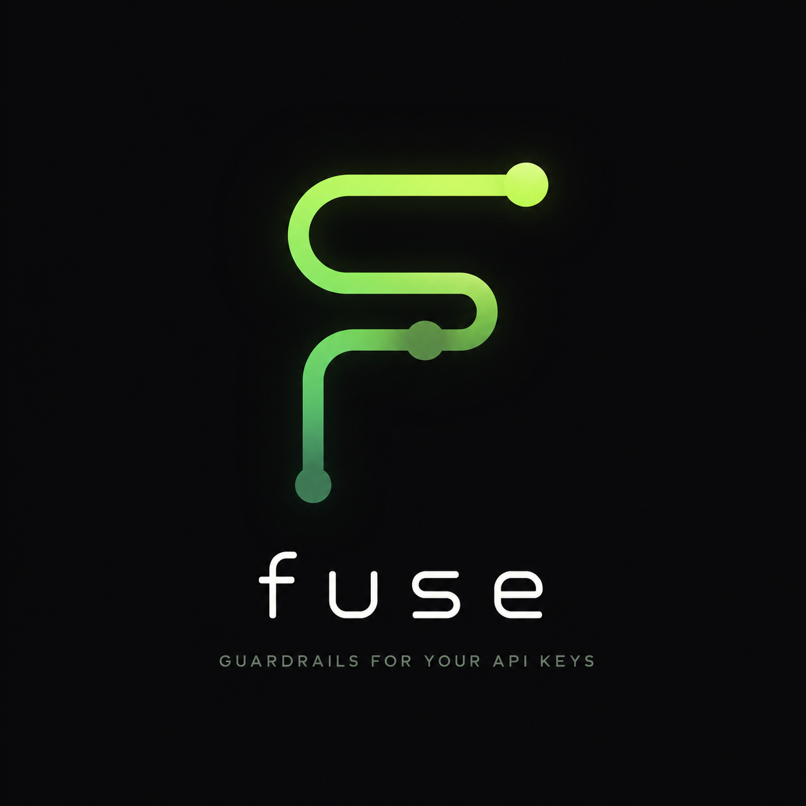

# Fuse

<p align="center">
  
</p>

Fuse is a local CLI proxy that tracks AI API spend and hard-stops requests before they exceed your budget.

## Quick Start

```bash
go install github.com/hashir500/Fuse@latest

fuse init

# Edit fuse.yml with your API keys and budgets.
$EDITOR fuse.yml

fuse proxy
```

Point your tool at the proxy:

```text
http://localhost:8787
```

Claude Code:

```bash
claude config set apiBaseUrl http://localhost:8787
```

Cursor or OpenAI-compatible tools: set the API base URL to `http://localhost:8787`.

Useful commands:

```bash
fuse status
fuse history --limit 10
fuse config validate
```

## Config Example

```yaml
providers:
  anthropic:
    base_url: "https://api.anthropic.com"
    api_key: "${ANTHROPIC_API_KEY}"
    models:
      claude-sonnet-4-20250514:
        input_cost_per_1k: 0.003
        output_cost_per_1k: 0.015
      claude-opus-4-20250514:
        input_cost_per_1k: 0.015
        output_cost_per_1k: 0.075

  openai:
    base_url: "https://api.openai.com"
    api_key: "${OPENAI_API_KEY}"
    models:
      gpt-4.1:
        input_cost_per_1k: 0.002
        output_cost_per_1k: 0.008

  google:
    base_url: "https://generativelanguage.googleapis.com"
    api_key: "${GEMINI_API_KEY}"
    models:
      gemini-2.5-pro:
        input_cost_per_1k: 0.00125
        output_cost_per_1k: 0.010
      gemini-2.5-flash:
        input_cost_per_1k: 0.0003
        output_cost_per_1k: 0.0025

budgets:
  daily:   {soft: 10.00, hard: 50.00}
  weekly:  {soft: 50.00, hard: 200.00}
  monthly: {soft: 200.00, hard: 500.00}

estimation:
  mode: max
  output_ratio: 0.3
  typical_output_tokens: 150

on_hard_cap: block
```
